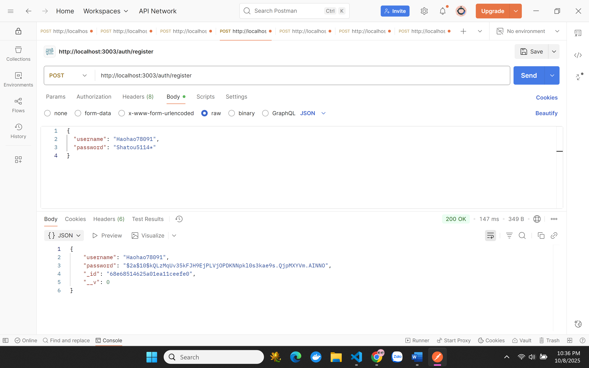
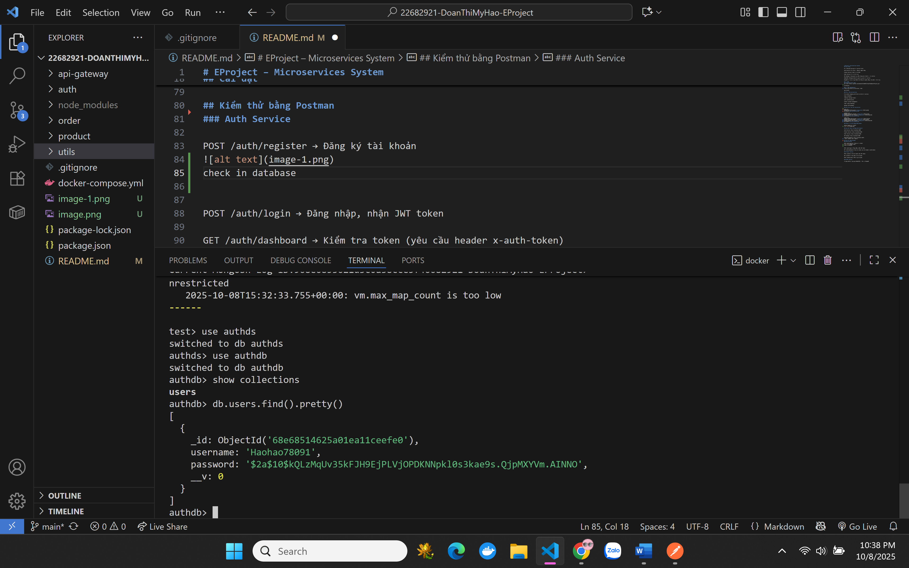
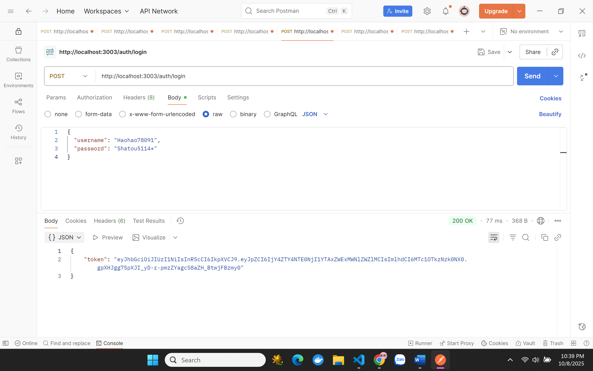
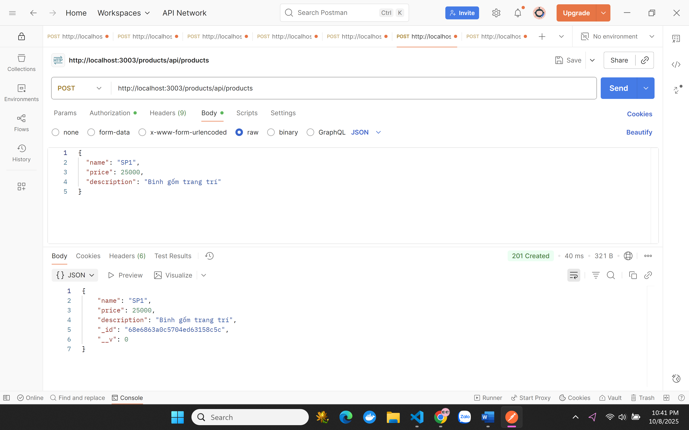
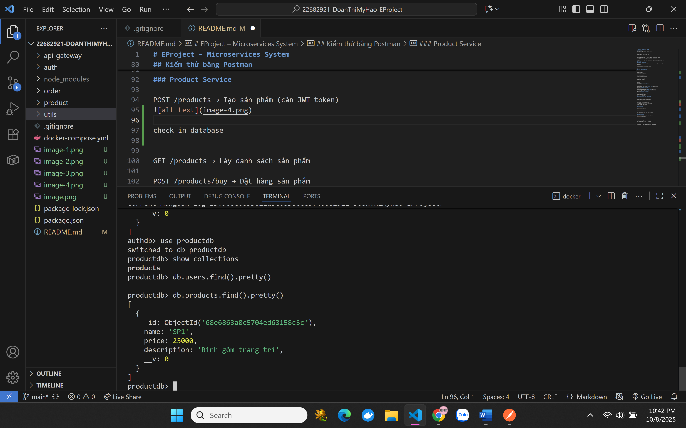
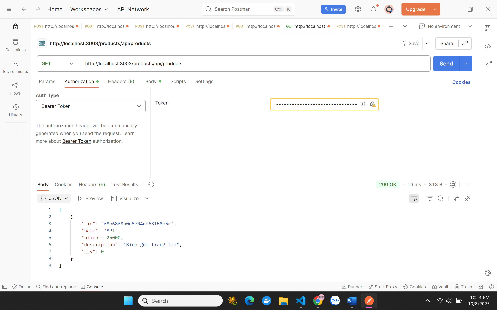
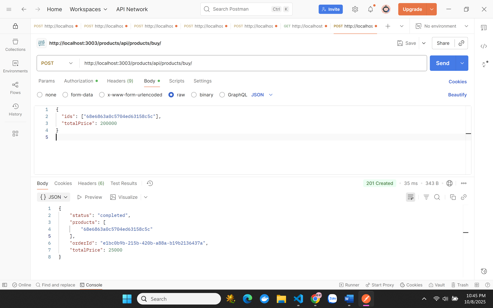
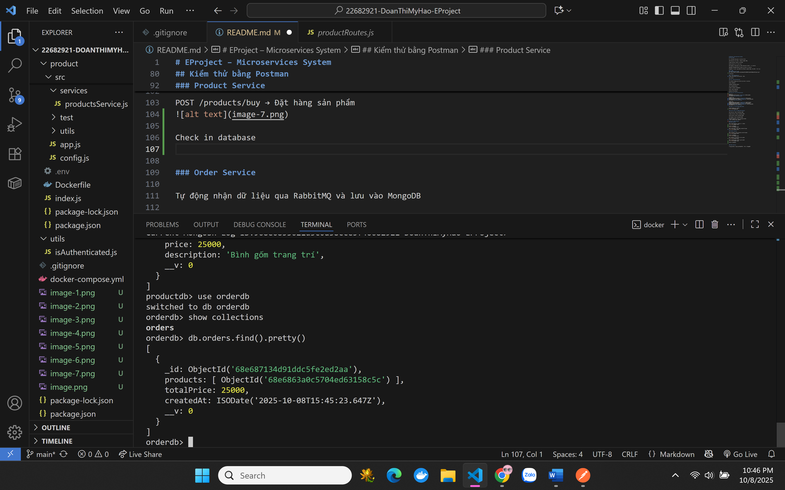

## EProject – Microservices System
## Giới thiệu

EProject là hệ thống được xây dựng theo kiến trúc Microservices, bao gồm các dịch vụ chính:

Auth Service – Xác thực và quản lý người dùng

Product Service – Quản lý sản phẩm

Order Service – Xử lý đơn hàng

API Gateway – Cổng giao tiếp tập trung giữa client và các service

RabbitMQ – Message broker hỗ trợ giao tiếp giữa các service

MongoDB – Cơ sở dữ liệu NoSQL lưu trữ thông tin người dùng, sản phẩm và đơn hàng

## Cài đặt
1. Tải source code
git clone https://github.com/PhanHongLieu/Project_SH.git
cd EProject

2. Cài đặt dependencies

Trong từng service (ví dụ: auth, product, order), chạy lệnh:

npm install

3. Cấu hình hệ thống microservices

File docker-compose.yml đã được cấu hình sẵn, bao gồm các service:

mongo – Cơ sở dữ liệu

rabbitmq – Message broker

auth – Dịch vụ xác thực

product – Dịch vụ quản lý sản phẩm

order – Dịch vụ xử lý đơn hàng

gateway – API Gateway trung gian

4. Tạo file .env cho từng service
auth/.env
MONGODB_AUTH_URI=mongodb://<mongo_host>:27017/authdb
JWT_SECRET=<your_jwt_secret_key>

product/.env
MONGODB_AUTH_URI=mongodb://<mongo_host>:27017/authdb
MONGODB_PRODUCT_URI=mongodb://<mongo_host>:27017/productdb
JWT_SECRET=<your_jwt_secret_key>

order/.env
MONGODB_ORDER_URI=mongodb://<mongo_host>:27017/orderdb
MONGODB_AUTH_URI=mongodb://<mongo_host>:27017/authdb
MONGODB_PRODUCT_URI=mongodb://<mongo_host>:27017/productdb
JWT_SECRET=<your_jwt_secret_key>

5. Khởi chạy hệ thống bằng Docker
docker-compose up --build

Sau khi khởi động thành công, các service hoạt động tại:

Auth Service: http://localhost:3000

Product Service: http://localhost:3001

Order Service: http://localhost:3002

API Gateway: http://localhost:3003

RabbitMQ Dashboard: http://localhost:15672
 (user: myname, pass: mypass)

MongoDB: mongodb://localhost:27017 (database: authdb, productdb, orderdb)

## Kiểm thử với Postman

Tất cả các request được gửi qua API Gateway (port 3003) để đảm bảo tính bảo mật và thống nhất endpoint.

Auth Service (port 3000)

POST /auth/register → Đăng ký tài khoản

POST /auth/login → Đăng nhập, nhận JWT token

Khi đăng ký thành công, dữ liệu được lưu trong cơ sở dữ liệu authdb.

Product Service (port 3001)

POST /products/api/products → Tạo sản phẩm (cần JWT token)

GET /products/api/products → Lấy danh sách sản phẩm

POST /products/api/products/buy/ → Đặt hàng sản phẩm

Khi có yêu cầu mua hàng, Product Service sẽ gửi dữ liệu đơn hàng đến Order Service thông qua RabbitMQ.

Order Service (port 3002)

Tự động nhận dữ liệu đơn hàng từ Product Service qua RabbitMQ

Lưu thông tin đơn hàng vào MongoDB (orderdb)

### Auth Service - Port 3000

POST /auth/register → Đăng ký tài khoản

check in database

POST /auth/login → Đăng nhập, nhận JWT token

### Product Service - Port 3001

POST /products/api/products → Tạo sản phẩm (cần JWT token)

check in database

GET /products/api/products → Lấy danh sách sản phẩm

POST products/api/products/buy/ → Đặt hàng sản phẩm

### Order Service - Port 3002
Tự động nhận dữ liệu đơn hàng được gửi từ Product Service thông qua RabbitMQ và lưu trữ vào MongoDB.

